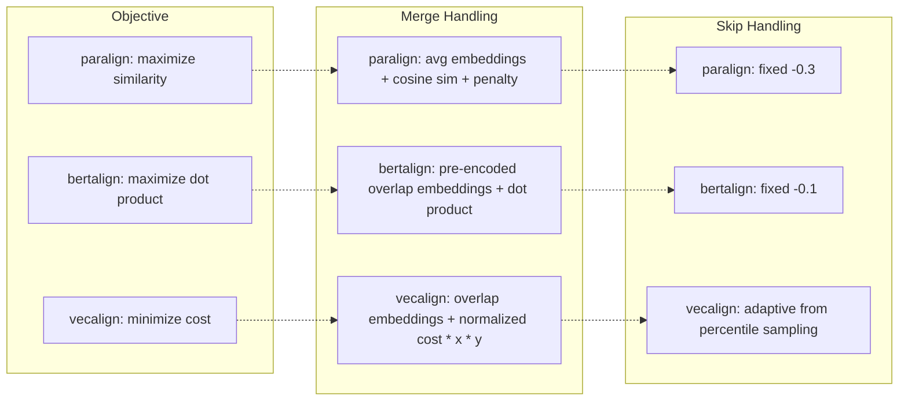

# Comparing paralign, bertalign, and vecalign DP Algorithms

This document compares the core dynamic programming alignment algorithms of three
sentence alignment systems: **paralign** (this repo), **bertalign**, and **vecalign**.
We built pure-Python reference reimplementations of bertalign and vecalign's DP cores
and ran identical test scenarios through all three to observe where they agree,
where they disagree, and why.

## Table of Contents

- [Algorithm Overview](#algorithm-overview)
- [Key Algorithmic Differences](#key-algorithmic-differences)
- [Test Infrastructure](#test-infrastructure)
- [Test Scenarios and Findings](#test-scenarios-and-findings)
- [Cross-Algorithm Invariants](#cross-algorithm-invariants)
- [Summary of Findings](#summary-of-findings)
- [How to Run](#how-to-run)

---

## Algorithm Overview

All three systems solve the same problem: given `n_src` source sentences and `n_tgt`
target sentences with pre-computed embeddings, find an optimal monotonic alignment
that may include 1:1 matches, N:M merges, and skips/deletions.

### paralign

Single-pass DP that **maximizes** cumulative cosine similarity.

- **Transitions**: 6 types -- `(1,1), (1,2), (2,1), (2,2), (1,0), (0,1)`
- **Scoring**: cosine similarity of averaged embeddings for N:M groups
- **Skip cost**: fixed penalty (default `-0.3`)
- **Merge cost**: additive penalty for non-1:1 matches (default `-0.05`)
- **Band pruning**: diagonal band of configurable width

### bertalign

Two-pass DP (anchors then refine). We reimplemented the **second pass** only,
which is the core alignment step.

- **Transitions**: `(0,1), (1,0)` for skips, plus all `(x,y)` where `x+y <= max_align`
  (default `max_align=5`, giving 15 transition types)
- **Scoring**: dot product of pre-computed **overlap embeddings** (normalized averages
  of consecutive sentence groups, encoded as a 3D array)
- **Skip cost**: fixed penalty (default `-0.1`, much cheaper than paralign's `-0.3`)
- **No separate merge penalty**: merge cost is implicit in the overlap embedding quality
- **Search-path windowing**: the second pass uses anchor points from the first pass
  to constrain the DP table (we disable this for small test inputs)

### vecalign

Hierarchical DP (coarse-to-fine). We reimplemented both the **dense** (1:1 only)
and **sparse** (arbitrary types) variants.

- **Objective**: **minimizes** cost (opposite of paralign/bertalign which maximize score)
- **Cost function**: `2 * x * y * (1 - dot) / (norm0 + norm1 + epsilon)`
  - `x, y`: alignment group sizes (scales cost with group size)
  - `norm0, norm1`: document-specific normalization factors (average dissimilarity
    to random samples from the other side)
- **Deletion penalty**: adaptive, computed from the 20th percentile of random
  alignment cost samples (document-specific, not a fixed constant)
- **Dense variant**: 3 transitions only -- diagonal (1:1), horizontal (target delete),
  vertical (source delete)
- **Sparse variant**: all `(x,y)` where `x+y <= max_align`, plus `(1,0)` and `(0,1)`

---

## Key Algorithmic Differences



| Aspect | paralign | bertalign | vecalign |
|---|---|---|---|
| **Objective** | Maximize score | Maximize score | Minimize cost |
| **Score/cost function** | Cosine similarity | Dot product | `2xy(1-dot)/(n0+n1)` |
| **Max merge size** | 2:2 (6 transitions) | Configurable, default 4:1 (15 transitions) | Configurable |
| **Merge penalty** | Additive (`-0.05`) | None (implicit) | Multiplicative (`x*y` scaling) |
| **Skip/deletion cost** | Fixed (`-0.3`) | Fixed (`-0.1`) | Adaptive (percentile) |
| **Normalization** | Per-pair cosine | Pre-normalized embeddings | Document-level norms |
| **Band pruning** | Yes (diagonal band) | Yes (search path from pass 1) | Hierarchical coarse-to-fine |

---

## Test Infrastructure

### ConstantEmbedder

A mock embedder (`tests/conftest.py`) that produces source and target embeddings
achieving an **exact** desired cosine-similarity matrix. This eliminates any
randomness or model dependency from the comparison.

**Construction**: source embeddings are standard basis vectors `e_i` in
`R^(n_src + n_tgt)`. Target embeddings place the similarity column `S[:, j]`
in the first `n_src` dimensions, with an orthogonal padding component at
dimension `n_src + j` to ensure unit norm. Precondition: each column of `S`
must have L2 norm < 1.

### Reference Implementations

Pure-Python reimplementations in `tests/reference_algorithms.py`:

- `bertalign_second_pass_dp()` -- full DP table (no search-path windowing)
- `vecalign_dense_dp()` -- 1:1 + deletions only
- `vecalign_sparse_dp()` -- arbitrary alignment types with `x*y` cost scaling
- `prepare_bertalign_inputs()` / `prepare_vecalign_inputs()` -- build 3D overlap
  embedding arrays and normalization factors
- `run_all_algorithms()` -- convenience runner returning normalized `AlignmentLink` format

All outputs use a common `AlignmentLink(src, tgt)` format for direct comparison.

---

## Test Scenarios and Findings

### Scenario 1: Perfect Diagonal (5x5)

**Setup**: Identity-like similarity matrix with 0.9 on diagonal, 0.05 elsewhere.

**Result**: All three algorithms produce identical 1:1 alignment `s[i] -> t[i]`.

**Finding**: When the signal is unambiguous, all algorithms agree regardless of
their different objective functions and penalty structures.

### Scenario 2: Clear Merges

#### 2:1 merge (3 src, 2 tgt)

**Setup**: `s[0]` and `s[1]` both have 0.7 similarity to `t[0]`; `s[2]` has 0.9 to `t[1]`.

**Result**: Both paralign and bertalign produce `[s0,s1]->t0, s2->t1`.

**Finding**: When merges are unambiguous, paralign and bertalign agree despite
different scoring mechanisms (cosine of averaged embeddings vs dot product of
overlap embeddings).

#### 1:2 merge (2 src, 3 tgt)

**Setup**: `s[0]` has 0.7 similarity to both `t[0]` and `t[1]`; `s[1]` has 0.9 to `t[2]`.

**Result**: Both produce `s0->[t0,t1], s1->t2`.

#### 2:2 merge (4 src, 4 tgt)

**Setup**: Cross-match pattern where monotonic 1:1 pairing gives low scores
(s0->t0 = 0.1, s1->t1 = 0.1) but cross-matches are high (s0->t1 = 0.5, s1->t0 = 0.5).

**Result**: paralign produces `[s0,s1]->[t0,t1], [s2,s3]->[t2,t3]`.

**Finding**: 2:2 merges only trigger when the monotonic 1:1 path is poor. With
a square high-similarity block (all 0.6), the 1:1 diagonal path dominates because
it produces 2 scores of 0.6 each (total 1.2), while a single 2:2 merge produces
one score of ~0.57 (merged cosine minus penalty). The 2:2 transition is only
worthwhile when sentence boundaries don't align cleanly with the other language.

### Scenario 3: Skip/Deletion

#### Source skip

**Setup**: 3 src, 2 tgt. Middle source (`s[1]`) has 0.05 similarity to everything.

**Result**: All three algorithms (paralign, bertalign, vecalign dense) skip `s[1]`:
`s0->t0, s1->skip, s2->t1`.

#### Target skip

**Setup**: 2 src, 3 tgt. Middle target (`t[1]`) has 0.05 similarity to everything.

**Result**: paralign skips `t[1]`: `s0->t0, skip->t1, s1->t2`.

#### Consecutive skips

**Setup**: 4 src, 2 tgt. `s[1]` and `s[2]` both have no good match.

**Result**: Both are skipped individually: `s0->t0, s1->skip, s2->skip, s3->t1`.

**Finding**: Skip decisions are consistent across algorithms when the signal is clear.
The per-sentence skip cost means consecutive skips accumulate linearly -- two skips
cost twice one skip.

### Scenario 4: Mixed (1:1 + merge + skip)

**Setup**: 6 src, 5 tgt with a designed similarity matrix encoding:
- `s[0] -> t[0]` (1:1, sim=0.9)
- `s[1,2] -> t[1]` (2:1 merge, sim=0.65)
- `s[3] -> skip` (all sims=0.05)
- `s[4] -> t[2]` (1:1, sim=0.9)
- `s[5] -> t[3,4]` (1:2 merge, sim=0.65)

**Result**: Both paralign and bertalign produce the expected mixed alignment.

**Finding**: When penalties are set appropriately (skip=-0.02, merge=-0.01 for
paralign; skip=-0.02 for bertalign), both algorithms handle complex mixed
alignments identically. The algorithms' DP structure is similar enough that
with matching penalty settings, they converge to the same solution.

### Scenario 5: Algorithm Disagreements

#### Merge vs skip tradeoff

**Setup**: 3 src, 2 tgt. `s[0]` has moderate match (0.4) to `t[0]`, `s[1]` has
moderate match (0.5) to `t[0]`, `s[2]` has high match (0.9) to `t[1]`.

**Finding**: The penalty settings determine whether the algorithm merges or skips:

| Configuration | Result |
|---|---|
| `skip=-0.5, merge=-0.01` | Merge: `[s0,s1]->t0, s2->t1` |
| `skip=-0.01, merge=-0.5` | Skip: `s0->skip, s1->t0, s2->t1` |

This is the fundamental design difference: paralign's default skip penalty (-0.3)
is 3x heavier than bertalign's (-0.1), making paralign more inclined to merge
borderline cases rather than skip sentences.

#### Merge penalty vs 1:1

**Setup**: 4x4 diagonal matrix with moderate (0.5) similarities.

**Finding**: With high merge penalty (-1.0), 1:1 is always preferred. With near-zero
merge penalty (-0.001), merges may occur. The merge penalty acts as a direct
regularizer on alignment granularity.

### Scenario 6: Parameter Sensitivity

#### paralign skip penalty sweep

**Setup**: 3 src, 2 tgt. `s[1]` has weak similarity (0.15) to all targets.

**Finding**: Sweeping skip penalty from -0.01 to -1.0:
- At `-0.01`: skip is cheap, `s[1]` gets skipped
- At `-0.3` and beyond: skip becomes expensive, algorithm switches to merging
  `s[1]` with a neighbor

The flip point occurs when `|skip_penalty|` exceeds the similarity gain from
matching `s[1]` in a merge.

#### bertalign skip sweep

**Finding**: Same pattern as paralign. At skip=-0.01, bertalign skips `s[1]`.
At skip=-0.5, it merges. The flip point differs slightly due to bertalign's
different scoring function (dot product of overlap embeddings vs cosine of
averaged embeddings).

#### vecalign deletion penalty sweep

**Setup**: 3x3 similarity matrix (equal-sized inputs required because vecalign's
dense variant is 1:1-only, so unmatched sentences on either side must both be
deleted).

**Finding**: At `del_penalty=0.01`, vecalign deletes both `s[1]` and `t[1]`.
At `del_penalty=2.0`, the double deletion cost (2x2.0=4.0) exceeds the poor
match cost, forcing `s[1]->t[1]` despite low similarity.

Key insight: vecalign's cost-minimization framework means deletion penalty is
_additive cost_ (higher = more reluctant to delete), opposite to paralign/bertalign
where skip penalty is _negative score_ (more negative = more reluctant to skip).

#### Merge penalty flip point

**Setup**: 3 src, 2 tgt where both `s[0]` and `s[1]` match `t[0]` with sim=0.5.

**Finding**: With `skip_penalty=-0.1`:
- The skip path scores: `0.5 + (-0.1) + 0.9 = 1.3`
- The merge path scores: `~0.707 + merge_penalty + 0.9`
- Flip point: `merge_penalty ~ -0.307` (where `1.607 + merge_penalty = 1.3`)

Sweeping merge penalty from -0.001 to -0.8 confirms both merge and non-merge
outcomes are observed, with the transition occurring near the predicted value.

---

## Cross-Algorithm Invariants

The following properties are verified to hold for **all three algorithms** across
diagonal, random rectangular (4x6), and random square (8x8) inputs:

1. **Full coverage**: every source and target index appears in exactly one alignment link
2. **Monotonicity**: source and target indices are strictly increasing across links

These invariants hold regardless of the specific alignment decisions made by each
algorithm.

---

## Summary of Findings

### Where algorithms agree

- **Unambiguous signals**: when diagonal similarities are high and off-diagonal are low,
  all three converge to identical 1:1 alignments
- **Clear merges**: when N sentences on one side clearly correspond to M sentences on
  the other, paralign and bertalign produce identical merge structures
- **Clear skips**: when a sentence has near-zero similarity to all candidates, all
  algorithms skip/delete it

### Where algorithms diverge

1. **Skip threshold**: paralign's heavier default skip penalty (-0.3 vs bertalign's -0.1)
   makes it more reluctant to skip sentences. In borderline cases, paralign will
   merge while bertalign skips. Vecalign's adaptive deletion penalty sits somewhere
   in between, calibrated to each document pair.

2. **Merge scoring**: paralign computes cosine similarity of averaged embeddings _at
   alignment time_. Bertalign uses _pre-encoded_ overlap embeddings (the overlapping
   text is re-encoded by the model). For our tests with ConstantEmbedder these produce
   similar results, but with real models the re-encoding captures semantic composition
   that simple averaging cannot.

3. **Cost vs score**: vecalign's cost-minimization with `x*y` scaling penalizes large
   merges quadratically, making it naturally conservative about large alignment groups.
   paralign's fixed merge penalty is linear; bertalign has no explicit merge penalty at all.

4. **Normalization**: vecalign's document-specific normalization factors mean the same
   similarity value can produce different alignment decisions depending on the overall
   distribution of similarities in the document pair. paralign and bertalign treat
   similarities as absolute values.

### Design implications

| If you want... | Best suited |
|---|---|
| Conservative skipping (preserve all content) | paralign (high skip penalty) |
| Aggressive splitting (prefer 1:1) | bertalign (low skip cost, many transition types) |
| Document-adaptive behavior | vecalign (adaptive deletion, normalization) |
| Simple, predictable tuning | paralign (two penalties, direct effect) |
| Large merge support (3:1, 1:4, etc.) | bertalign (max_align up to 5+) |

---

## How to Run

```bash
# Run just the comparison tests
uv run pytest tests/test_algorithm_comparison.py -v

# Run all tests (including existing paralign tests)
uv run pytest tests/ -v
```

### Files

| File | Purpose |
|---|---|
| `tests/conftest.py` | `ConstantEmbedder` class (+ existing test fixtures) |
| `tests/reference_algorithms.py` | Pure-Python bertalign/vecalign DP reimplementations |
| `tests/test_algorithm_comparison.py` | 32 comparison tests across 6 scenarios |
